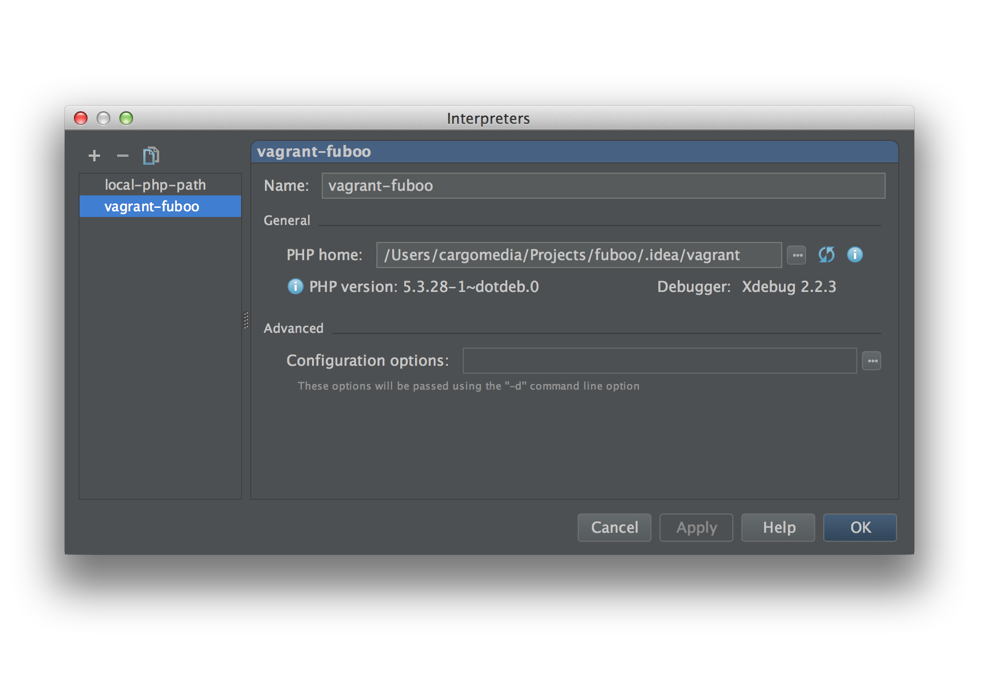
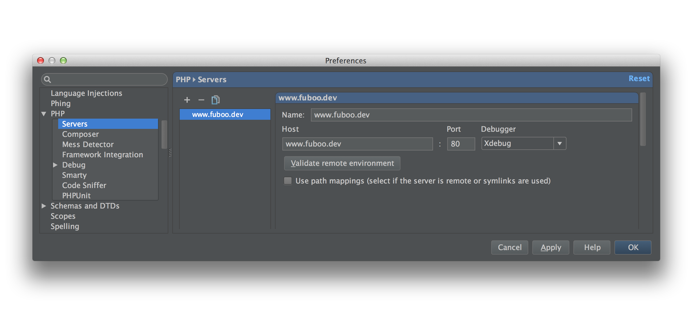

vagrant-phpstorm-tunnel
=======================
`vagrant-phpstorm-tunnel` installs a proxy php binary which can be configured as a php-interpreter in [PhpStorm](http://www.jetbrains.com/phpstorm/).
It will forward all php calls to `php` in the [Vagrant](http://www.vagrantup.com/) VM.

This is a workaround for a missing feature in PhpStorm (see http://youtrack.jetbrains.com/issue/WI-19485).

Installation
------------
```sh
vagrant plugin install vagrant-phpstorm-tunnel
```

Vagrantfile
-----------
You can configure your `project_home` path within `vagrant` machine. This is needed for proper paths mapping from `PhpStorm` during debugging (please have a look also section below).
```ruby
Vagrant.configure('2') do |config|
  (...)
  config.phpstorm_tunnel.project_home = '/home/vagrant/fuboo'
end
```
By default the plugin assumes that your project is shared as `/vagrant` in the VM. It will copy PhpStorm's helper-scripts into `.idea/vagrant/tmp/` to make them accessible from within the VM.

PhpStorm
--------
`vagrant-phpstorm-tunnel` will create a file `.idea/vagrant/php` in your vagrant-project.

Select this file as a PHP interpreter in PhpStorm:


Add PHP server for your project


VM
--
You should also export `PHP_IDE_CONFIG` parameter into `VM` environment with the same value as your PHP server name configured above
```
export PHP_IDE_CONFIG='serverName=www.fuboo.dev'
```
This is recommended to append above line to `~/.profile` file of your `VM`
